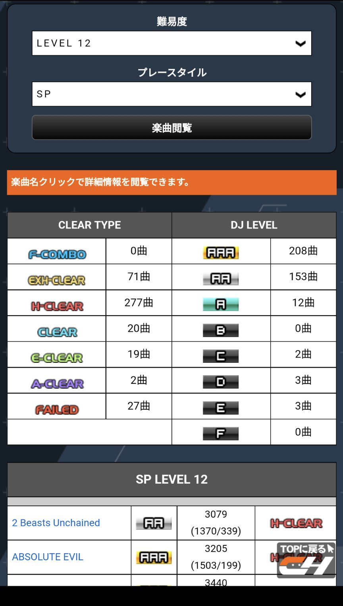

フォロワーのブログを真似て書いてみる。

## 読書

先月は 3 冊読んだ。小説を読んで現実逃避してることが最近増えた。読んだ本は以下。

- 汝、星のごとく
- 夜に星を放つ
- 僕が愛したすべての君へ

汝、星のごとくが特に良かった。恋愛小説だけど複雑な人間関係が描かれた内容になっているので読んでいて結構しんどくはなる。

僕が愛したすべての君へ（僕愛）は君を愛したひとりの僕へ（君愛）の 2 本立てになっていて、両方読むことでそれぞれの内容が補間される作品になっている。
先月頭に映画が公開されて、原作を読んでから観ようと思っていたけど両方読みきれなかった。映画は君愛から観たが、予め僕愛を読んでて良かったなと思う内容だった。
映画だけで楽しむ場合は、僕愛から観るのがおすすめ。

## beatmania

CastHour が終了して RESIDENT が新たに稼働した。とうとう 30 作目。
新作になってアプリケーションの強制終了が発生するようになったので KONAMI 修正頑張ってくれ…となっている。

CastHour は個人的に飛躍の作だった。12 鳥が 200 曲超えたり、ファーダリにハードが点いたりなど上手くなったなーと思えた。

今作も気が向いたらエクハランプを増やしつつ、前作鳥出せていない 12 の鳥埋めを頑張りたい。
毎作言ってるけど新作稼働する度に良い曲ばかりだーとなっている。
新曲だと以下をよく選曲してる気がする。

- wanna be a "BAD GIRL" feat. Nana Takahashi
- Ruler or Loser
- THE TIME MACHINE

中でもイチオシは Shadow World。一番良いのでやったことない人も聴いてほしい。

<iframe width="560" height="315" src="https://www.youtube.com/embed/jJbbUmhBCYU" title="YouTube video player" frameborder="0" allow="accelerometer; autoplay; clipboard-write; encrypted-media; gyroscope; picture-in-picture" allowfullscreen></iframe>
