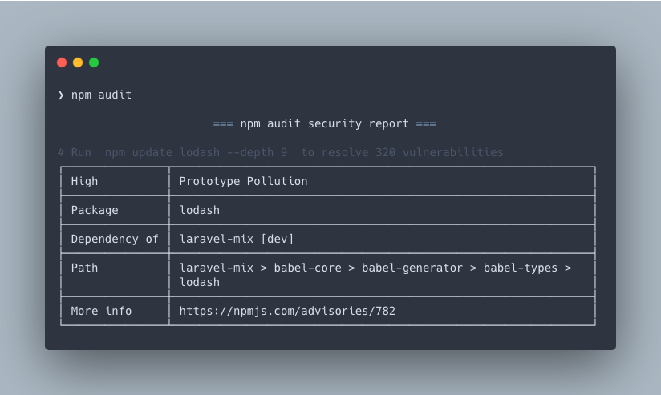

あるリポジトリを見たらセキュリティの脆弱性があるよとのことだったので、プロダクトとかではないので悪影響はないが更新しておいた。

## 脆弱性のチェック

npm には脆弱性をチェックするコマンドが用意されているので CLI から実行することで確認できる。
`--audit-level` オプションで脆弱性のレベルを指定して確認することもできる。

```bash
$ npm audit [--audit-level(low|moderate|high|critical)]
```

上記のコマンドを実行すると脆弱性となっている箇所とアップデートのコマンドを表示してくれる。



## パッケージのアップデート

パッケージのアップデートは以下の方法がある。

- `npm audit fix`
- `npm audit fix --force`
- `npm audit` で表示されたアップデートコマンドの実行

`npm audit fix --force` については破壊的変更があるものまで更新してしまうので実行する際は注意が必要。
`npm audit fix` で更新されなかった部分が破壊的変更を含んでいるので、再度 `npm audit` で確認してから更新するのが無難だと思う。
