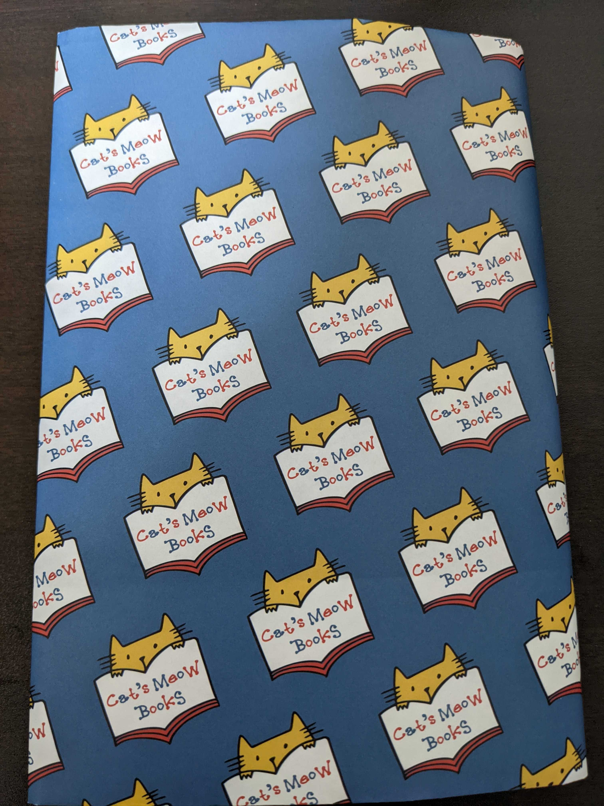

久方ぶりの更新。昨日 [月曜日の抹茶カフェ](https://www.amazon.co.jp/dp/B09CD7Y3K2/ref=dp-kindle-redirect?_encoding=UTF8&btkr=1) を読み終えた。

マーブル・カフェという喫茶店から話が始まり、ひと月ごとに様々な人物に焦点を当てた物語となっている。
また、ひと月ごとの内容は 20 ページ程度と長くなく読み進めやすかった。

あらすじに「この縁は、きっと宝物になる」とあるように本文中ではふとしたきっかけが縁となり、登場人物それぞれに影響を与えていた。
ある人が他者の背中を押している描写が多く、温かい気持ちにしてくれた。自分も誰かの背中を押せているといいのだが。

#### 余談

月曜日の抹茶カフェは [Cat's Meow Books](https://catsmeowbooks.stores.jp/) というお店にたまたま立ち寄ったときに目がついて買った。
このお店には保護猫が居て、本を探しつつ猫も眺めることができるので猫が好きな方はぜひ一度行ってみてほしい。

自分が月曜日の抹茶カフェを手に取ったように、思いがけない本との縁があるかもしれない。
