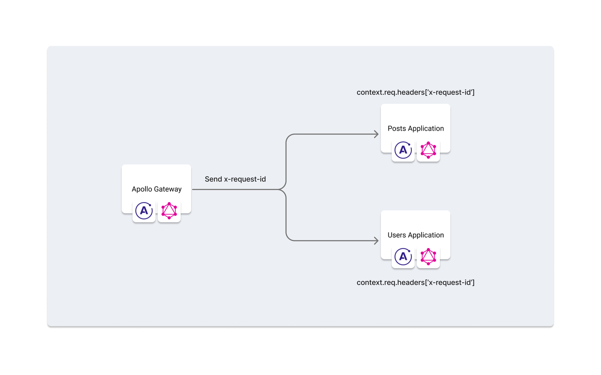
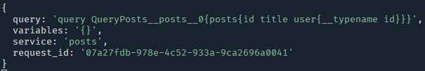
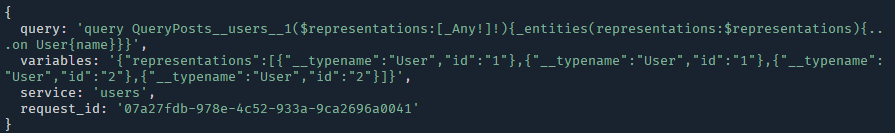

+++
title = "リクエストIDを追加して調査を快適にする"
slug = "send-request-id-from-gateway"
draft = false
date = 2023-01-07T15:00:00.000+09:00

[taxonomies]
tags = ["GraphQL", "Apollo", "NestJS"]

[extra]
category = "Diary"
+++

この記事は Zenn で投稿していた内容を移行したものになります。

## はじめに

現在 API のログは出力しているのですが、1 リクエスト内で実行された GraphQL Query が把握しづらいという課題がありました。

今回は Apollo Gateway の RemoteGraphQLDataSource を使用してリクエストヘッダに ID を付与し、各アプリケーションの GraphQL context から参照できるようにすることで改善を試みました。



本記事では NestJS を使用したコードになっています。実装にあたり使用したバージョンは下記になります。

- Node.js v18.12.1
- Apollo Server v3.11.1
- NestJS v9.2.1
- yarn v1.22.19
- @nestjs/cli v9.1.5

## ゲートウェイでリクエスト ID のヘッダを追加する

最初に各アプリケーションへ送信するリクエスト ID を設定します。

Apollo Server の context でリクエスト ID を生成し、`RemoteGraphQLDataSource.willSendRequest` で生成された ID をヘッダに追加します。ヘッダは `x-request-id` とします。

<div class="code-title">gateway/src/app.module.ts</div>

```typescript
import { IntrospectAndCompose, RemoteGraphQLDataSource } from '@apollo/gateway';
import { ApolloGatewayDriver, ApolloGatewayDriverConfig } from '@nestjs/apollo';
import { Module } from '@nestjs/common';
import { GraphQLModule } from '@nestjs/graphql';
import { v4 } from 'uuid';

@Module({
  imports: [
    GraphQLModule.forRoot<ApolloGatewayDriverConfig>({
      driver: ApolloGatewayDriver,
      server: {
        cors: true,
        context: () => {
          // RemoteGraphQLDataSource で扱う requestId を定義
          return { requestId: v4() };
        },
      },
      gateway: {
        supergraphSdl: new IntrospectAndCompose({
          subgraphs: [
            { name: 'posts', url: 'http://localhost:3001/graphql' },
            { name: 'users', url: 'http://localhost:3002/graphql' },
          ],
        }),
        buildService: ({ url }) =>
          new RemoteGraphQLDataSource<{ requestId: string }>({
            url,
            willSendRequest: ({ request, context }) => {
              // server.context で定義した requestId をヘッダに設定
              request.http.headers.set('x-request-id', context.requestId);
            },
          }),
      },
    }),
  ],
})
export class AppModule {}
```

## アプリケーションのログにリクエスト ID を追加する

次にアプリケーションでログ出力できるようにします。
Apollo Server では `ApolloServerPlugin` を使ってロギングを行えます。

また、ヘッダを参照するためのリクエストオブジェクトは GraphQL context から参照できます。

<div class="code-title">logging.plugin.ts</div>

```typescript
import { Plugin } from '@nestjs/apollo';
import { ExpressContext } from 'apollo-server-express';
import {
  ApolloServerPlugin,
  GraphQLRequestContext,
  GraphQLRequestListener,
} from 'apollo-server-plugin-base';

@Plugin()
export class LoggingPlugin implements ApolloServerPlugin {
  async requestDidStart(
    requestContext: GraphQLRequestContext<ExpressContext>
  ): Promise<GraphQLRequestListener<ExpressContext>> {
    return {
      willSendResponse: async ({ context }) => {
        const {
          request: { query, variables },
        } = requestContext;
        console.log({
          query,
          variables: JSON.stringify(variables),
          request_id: context.req.headers['x-request-id'],
        });
      },
    };
  }
}
```

## 動作確認

上記を適用したサンプルコードを用意しました。
手元で実行してみたい場合は下記のリポジトリをクローンしてください。

https://github.com/choco14t/example-gateway-logging

<!--
:::details ゲートウェイ・アプリケーションの起動
`cd` のパスは適宜書き換えてください。
-->

```sh
cd application-posts && yarn start
```

```sh
cd application-posts && yarn start
```

```sh
cd gateway && yarn start
```

<!--
:::
-->

http://localhost:3000/graphql をブラウザで開きプレイグラウンドから次のクエリを実行してみます。

```graphql
query QueryPosts {
  posts {
    id
    title
    user {
      id
      name
    }
  }
}
```

実行すると以下のようなログが出力されることを確認できます。





同じリクエスト ID が送信されていますね。Good👍。

## Appendix

### Rails のログにリクエスト ID を追加する

今回、NestJS アプリケーションに加えて Rails アプリケーションにもリクエスト ID を反映させる対応をしていたのでおまけとして書いておきます。

Rails では `config.log_tags` を使うことでログにタグ付けが行えます。`config.log_tags = [:uuid]` とすることでログ 1 行に対して ID が付与されます。このとき、Rails では `x-request-id` のヘッダ情報が参照されるため、今回のようにゲートウェイで設定した ID を使うことができます。

<!--
:::details config/environments/development.rb
-->

<div class="code-title">config/environments/development.rb</div>

```rb
Rails.application.configure do
  # ...

  config.log_tags = [:uuid]

  # ...
end
```

<!--
:::
-->

今回リクエストヘッダを `x-request-id` とした理由はこのためです。

### Rails + lograge のログにリクエスト ID を追加する

lograge を使ってログ出力をしている場合は `config.lograge.custom_options` を使ってパラメータを追加することでログに ID を追加できます。

Datadog と連携している場合は次の設定をすることで `request_id` によるフィルタリングが可能になります。

<!--
:::details app/controllers/application_controller.rb
-->

<div class="code-title">app/controllers/application_controller.rb</div>

```rb
class ApplicationController < ActionController::Base
  def append_info_to_payload(payload)
    super
    payload[:request_id] = request.headers['x-request-id']
  end
end
```

<!--
:::
-->

<!--
:::details config/environments/development.rb
-->

<div class="code-title">config/environments/development.rb</div>

```rb
Rails.application.configure do
  # ...

  config.lograge.enabled = true
  config.lograge.keep_original_rails_log = true
  config.lograge.logger = ActiveSupport::Logger.new "#{Rails.root}/log/lograge_#{Rails.env}.log"
  config.lograge.formatter = Lograge::Formatters::Json.new
  config.lograge.custom_options = lambda do |event|
    { request_id: event.payload[:request_id] }
  end

  # ...
end
```

<!--
:::
-->

## さいごに

今回はゲートウェイを使用したロギング改善の解説と、おまけとして Rails アプリケーションでの設定方法を紹介しました。

Apollo Gateway を使ったアプリケーションの運用をされている方、Apollo Gateway の使用を検討している方の参考になれば幸いです。

## 参考

- [API Reference: @apollo/gateway - Apollo GraphQL Docs](https://www.apollographql.com/docs/apollo-server/using-federation/api/apollo-gateway)
- [packages/apollo-server-express/src/ApolloServer.ts#L48-L51](https://github.com/apollographql/apollo-server/blob/apollo-server-express%403.11.1/packages/apollo-server-express/src/ApolloServer.ts#L48-L51)
- [Rails のログに含まれる request_id についてコードリーディングしたメモ](https://zenn.dev/bisque/scraps/e0c58eb6fd07fa)
- [Rails の logger 周りのコードリーディング](https://blog.freedom-man.com/rails-logger-codereading)
- [roidrage/lograge](https://github.com/roidrage/lograge)