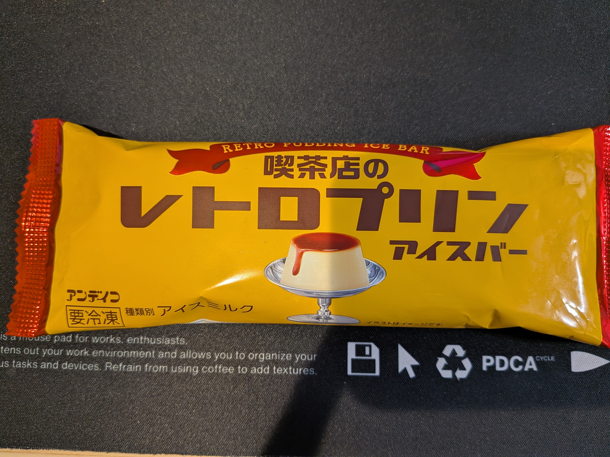

+++
title = "今日のアイス"
slug = "todays-ice"
draft = false
date = 2026-07-07T22:53:00.000+09:00

[taxonomies]
tags = ["Diary"]

[extra]
category = "Diary"
+++

その日に食べたアイスの写真を撮って Bluesky にアップしている。  
いつからか始めて気づけば今も続けている。

なぜアイスの写真を撮って投稿するようになったのかを改めて考えてみた。

- アイスを頻繁に食べるから
- おいしいものの共有

数分考えてみたけど大した理由は浮かばず。  
でもアイス嫌いな人少ないだろうし、アイスの画像が流れてきて不快にならないだろうしいいかと思っている。  
出かけた先で食べた美味しいものを撮る代わりに今日食べたアイスの記録を残している感じ。

撮った写真は Google Photo にアップロードしているので年ごとにアルバムを作成している。  
たまにアルバムに入っている画像を見返して、これまた食べたいな、これ美味しかったなと振り返れて少し幸せになれるのでおすすめ。  

最近食べたアイスだと、喫茶店のレトロプリンアイスバーが美味しかった。固めでカラメルがほろ苦いプリンをそのままアイスにしたようでプリンが好きならたまらないと思う。

私の場合はアイスだけど、家に猫がいるのであればその日の寝顔を撮ってみるもよし。  
散歩によく行く人であれば道で見かけた花を 1 枚撮ってみると季節の移り変わりが感じられたり。
写真に収めてみると、その何気ない時間が自分にとって大事な時間だと気付くきっかけになるかもしれない。

何かと移り変わりの早い世の中だけど、ふんわり綿のようにゆるく生きていきたい。

> 無理をするなら、ふんわりいこうよ  
> エルデンリング ふんわり綿のフレーバーテキスト
