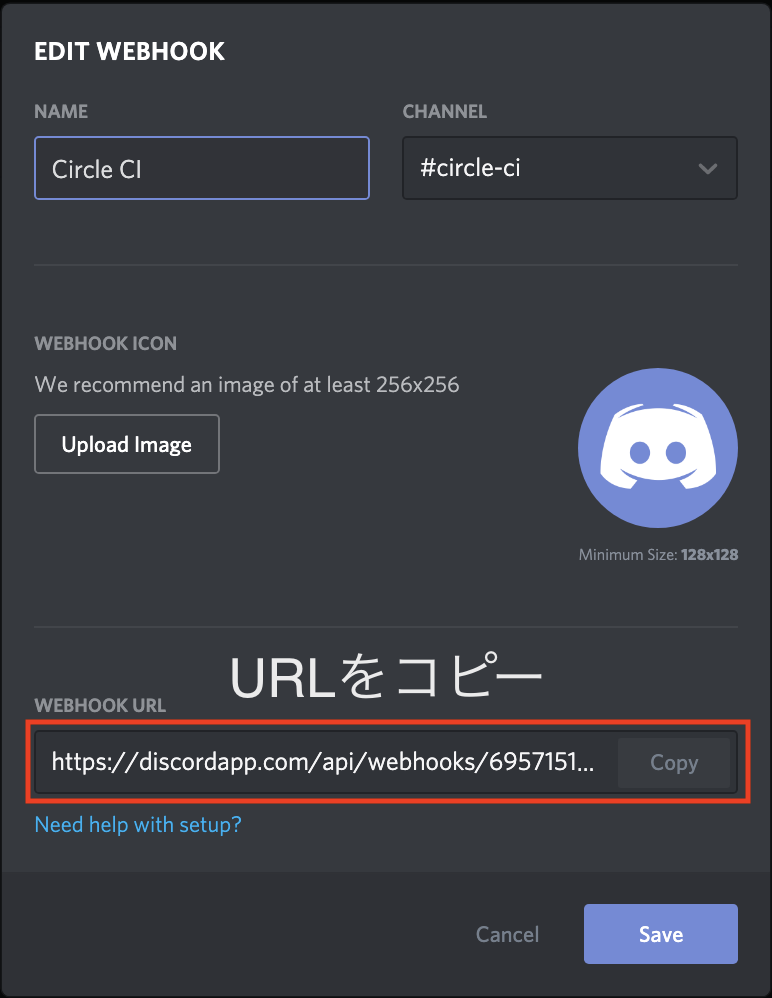
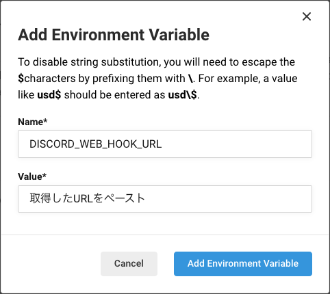

## Webhookの追加

まずは通知するチャンネルとWebhook URLが必要なので作成する。
チャンネルの作成については割愛。

作成したチャンネルの歯車アイコンから設定画面を開いてサイドバーの「Webhooks」をクリックするとWebhookの管理画面が開く。
「Create Webhook」ボタンをクリックして名前やアイコンなどを設定して保存すれば完了。
この時、作成画面に表示されるWebhook URLをクリップボードにコピーしておく。



Circle CIのロゴを設定したい場合は[こちら](https://brandfolder.com/circleci)からDLできる。

## 環境変数の設定

`config.yml`にURLを直接書くのを避けるためにプロジェクトの環境変数へWebhook URLを追加する。

トップページから通知したいプロジェクトの歯車アイコンをクリックする。
BUILD SETTINGS > Environment Variablesをクリックして「Add Variable」ボタンから環境変数を追加する。
例として`DISCORD_WEB_HOOK_URL`を追加する。



## config.ymlの編集

カバレッジレポートの出力設定は[公式ドキュメント](https://circleci.com/docs/ja/2.0/code-coverage/#php)に書かれている。

公式ドキュメントの設定を編集して以下のようにする。

```yml:title=config.yml
version: 2
jobs:
  build:
    docker:
      - image: circleci/php:7-fpm-browsers-legacy
    steps:
      - checkout
      - run:
          name: Run tests
          command: phpdbg -qrr vendor/bin/phpunit --coverage-html build/coverage-report
      - store_artifacts:
          path:  build/coverage-report
      - run:
          name: Notify to discord
          command: |
            curl -sS -XPOST -H "Content-Type: application/json" \
            -d '{"content": ":newspaper: [Coverage report](https://'"$CIRCLE_BUILD_NUM"'-{ID}-gh.circle-artifacts.com/0/build/coverage-report/index.html)"}' \
            $DISCORD_WEB_HOOK_URL >/dev/null
```

上記設定の環境変数について補足。

* `$CIRCLE_BUILD_NUM`は[定義済み環境変数](https://circleci.com/docs/ja/2.0/env-vars/#%E5%AE%9A%E7%BE%A9%E6%B8%88%E3%81%BF%E7%92%B0%E5%A2%83%E5%A4%89%E6%95%B0)。CircleCIでのビルド回数。
* `{ID}`はプロジェクトごとに設定される値。Circle CIで生成されたリンクを参照する。

`index.html`については任意のファイルを選択できるのでお好みで。

## 完成

実際にCIを動かしてみてDiscordに通知されれば完了。


Laravel用を[gist](https://gist.github.com/choco14t/e6d5b0f6803fbf847ba58b851738a9cb)に公開したので参考になれば。

## 参考

* [SlackでCircleCIからカバレッジレポート通知を受け取る設定手順 - Qiita](https://qiita.com/gold-kou/items/24a1d68a65d641115b9e)
